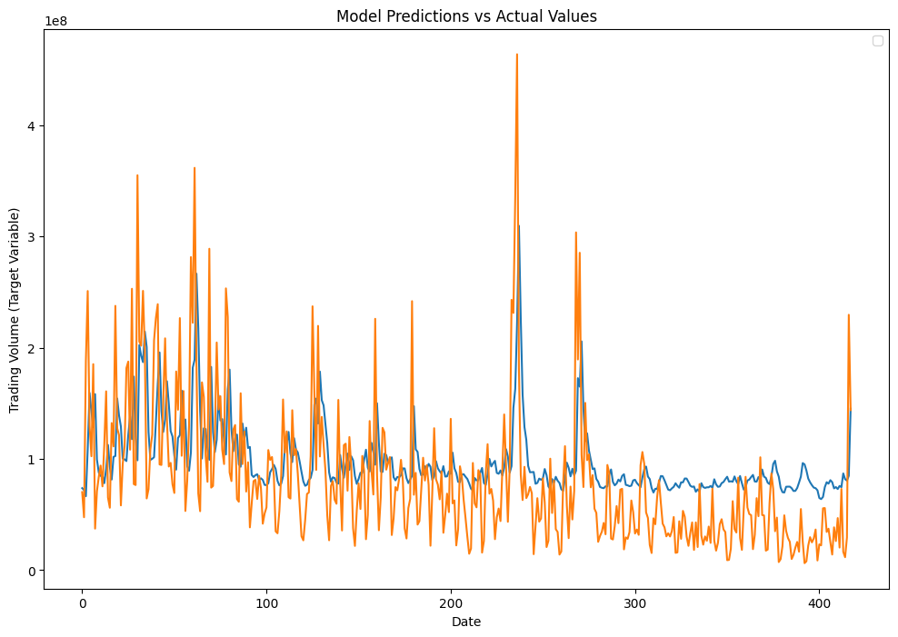

# Stock Volume Prediction (time series) using deep neural networks (RNN)

## Table of Contents
- [Project Description](#project-description)
- [Project Structure](#project-structure)
- [Model Architecture](#model-architecture)
- [Training and Evaluation](#training-and-evaluation)
- [Results](#results)

## Project Description
The project focuses on stock volume prediction.
The train dataset has 320 latent features derived from the original time series and the last column of the training dataset is the one-day ahead trading volume of the asset, which is to be forecasted.
In the test dataset, we have access only to the 320 latent features derived from the original attributes on the testing period.
What makes it challenging though is the fact that the features have no names and are simply numbered from 0 to 319.
Moreover all the features are very large numric values such that it is almost impossible to interpret them visually.

The train dataset has 2103 samples and is divided such that train : validation = 80 : 20 

## Project Structure
- Loading the dataset
- Exploratory data analysis
- Data scaling
- Batching the data for training
- Model Setting, Training and Evaluation
  - LSTM
  - GRU
- Comparison and conclusion

## Model Architecture
- LSTM
- GRU

## Training and Evaluation

## Results
- In this exercise, GRU(64) performed better on validation set compared to LSTM(64).  
Although I have tried my best to avoid overfitting by reducing the model complexity and introducing L2 penalty, the overfitting possibility cannot be totally ruled out since the dataset is very small.

- At this point, for the same configuration, MSE on validation for GRU is 0.88 whereas for GRU is 2.9

- The plots help to visualizing the GRU predictions.

  
  

